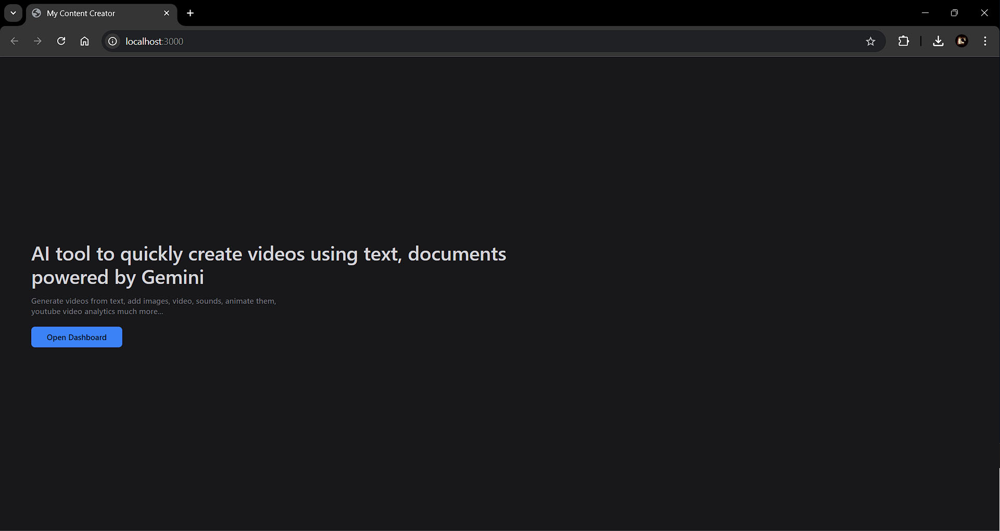
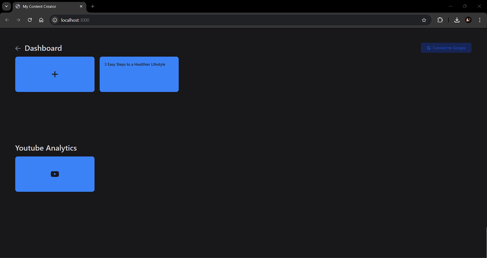
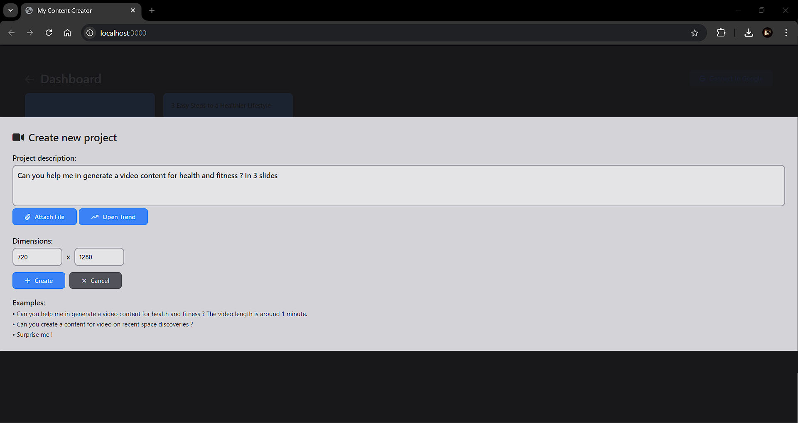
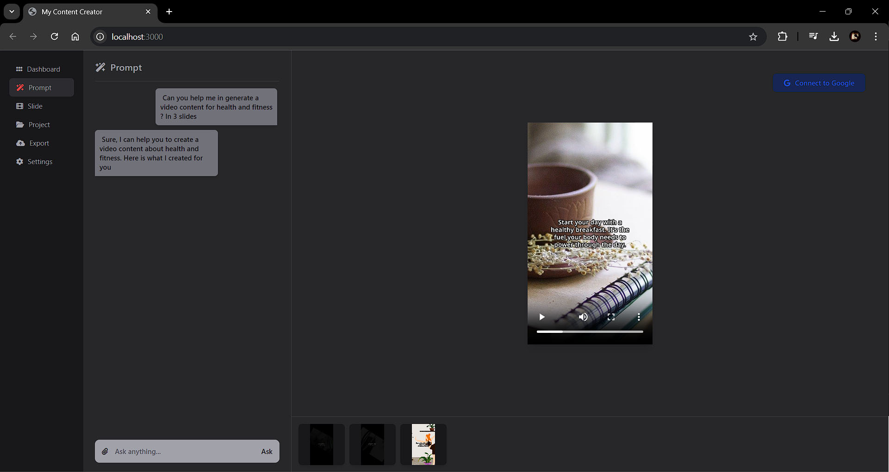
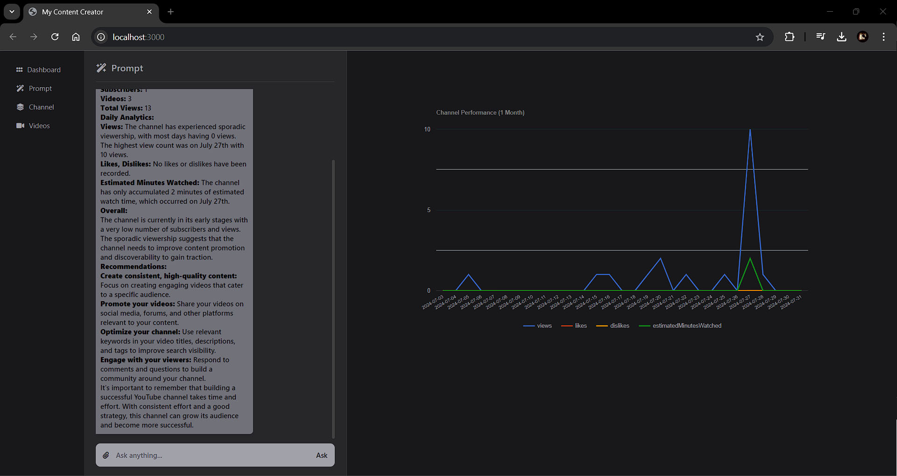
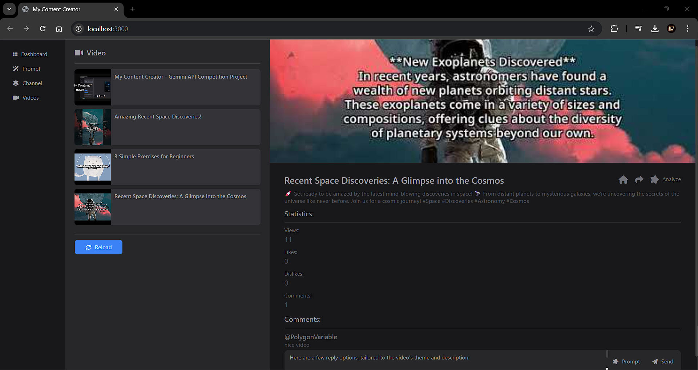

# My Content Creator
My Content Creator is a AI web application to quickly generate short videos and analyze youtube videos and channel, powered by Google Gemini.

## Features
- Generate video using prompt.
- Prompt based video editor along with manual editor.
- Add image, audio and video along with narration and Google Drive import support.
- Upload video to YouTube and Google Drive.
- Review the YouTube channel or its video using Gemini.
- Generate comments.

## Table of Contents

- [Installation](#installation)
    - [Prerequisites](#prerequisites)
    - [Steps](#steps)
- [Running the Application](#running-the-application)
    - [Windows](#windows)
    - [Linux (Debian)](#linux-debian)
- [Screenshots](#screenshots)

## Installation

### Prerequisites
- Node.js (>v18.17.0) and npm installed
- Pixabay API key: [Get Pixabay API Key](https://pixabay.com/api/docs/)
- Google Gemini API key: [Get Gemini API Key](https://aistudio.google.com/app/apikey)
- Google Cloud Platform service account and OAuth2 client JSON file:
    - Service account with appropriate permissions (YouTube Data API v3, YouTube Analytics API, Google Drive API, Cloud Text-to-Speech API, Cloud Translation API)
        - [Create a Service Account](https://console.cloud.google.com/iam-admin/serviceaccounts)
    - OAuth 2.0 client ID credentials
        - [Create OAuth 2.0 Client ID](https://console.cloud.google.com/apis/credentials)
        - **Important:** In the `googleoauth2-client.json` ensure you've added "http://localhost:3000/api/google/auth/callback" to the *Authorized redirect URIs* section. Your `web.redirect_uris` field in the credential file should include "http://localhost:3000/api/google/auth/callback".
        - Refer to [/src/secret/README.md](/src/secret/README.md) for detailed instructions on obtaining and configuring Google credentials.
    
### Steps
1. **Clone the repository:**
    ```
    git clone https://github.com/ayushpaultirkey/my-content-creator.git
    cd my-content-creator
    ```

2. **Configure the .env file:**
    ```
    NODE_ENV="development"
    PIXABAY_API="PIXABAY_KEY_HERE"
    GOOGLE_GEMINI_API="GEMINI_API_KEY_HERE"
    GOOGLE_APPLICATION_CREDENTIALS="src/secret/googlecloud-service.json"
    GOOGLE_OAUTH2_CLIENT="src/secret/googleoauth2-client.json"
    ```

3. **Place the credential and service files in the `src/private` folder:**
    - `src/private/googlecloud-service.json` (from the Service Account section)
    - `src/private/googleoauth2-client.json` (from the OAuth 2.0 Client IDs section)

4. **Install npm modules:**
    ```
    npm install
    ```

### Running The Application
#### **Windows**
1. **Install the fonts:**
    Navigate to `/project/.font/static` and install all the fonts.

2. **Download the ffmpeg builds:**
    - Run the `npm run download` command to download the ffmpeg builds. The files will be downloaded in the `/library` folder.
    - (Manual option): If the download fails, you can manually download the ffmpeg build from [FFmpeg Releases](https://github.com/ffbinaries/ffbinaries-prebuilt/releases/tag/v6.1) and place it in the `/library` folder:
        - `/library/ffmpeg.exe`
        - `/library/ffprobe.exe`

3. **Install sharp package:**
    ```
    npm install sharp@latest
    ```

4. **Starting the application:**
    ```
    npm start
    ```
    Navigate to [http://localhost:3000/](http://localhost:3000/)

#### **Linux (Debian)**
1. **Install FFmpeg:**
    ```
    sudo apt update
    sudo apt install ffmpeg
    ```

2. **Optional (headless environment):**
    If you don't have a graphical display (e.g., on a server), install these dependencies:
    ```
    sudo apt-get install libcairo2-dev libjpeg-dev libpango1.0-dev libgif-dev build-essential g++
    sudo apt-get install libgl1-mesa-dev xvfb libxi-dev libx11-dev 
    ```

3. **Install sharp package:**
    ```
    npm install sharp@0.32.6
    ```

4. **Start the application:**
    - **With graphical display:**
        ```
        npm start
        ```
    - **Headless environment:**
        ```
        xvfb-run -s "-ac -screen 0 1280x1024x24" npm start 
        ```

    Navigate to [http://localhost:3000/](http://localhost:3000/)

## Screenshots

#### Home:


#### Dashboard:


#### Creator:


#### Editor:


#### Analytics:


#### Videos:
